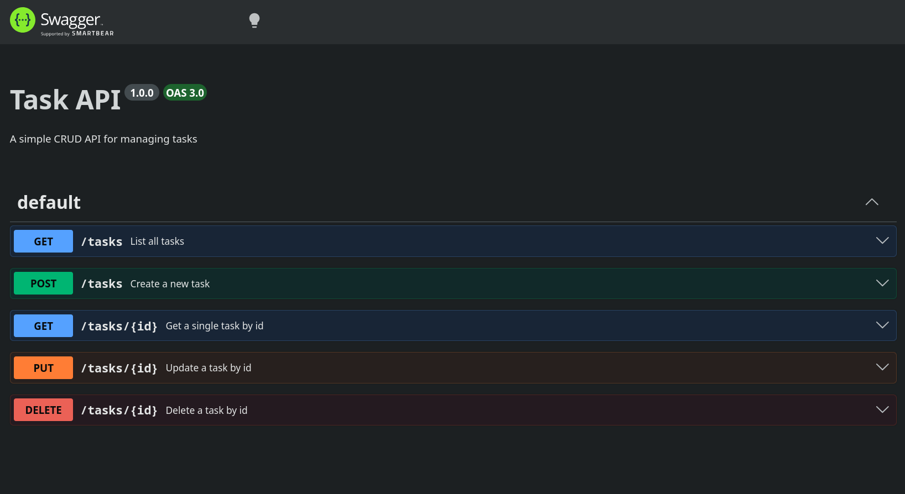

# Task API

A simple CRUD (Create, Read, Update, Delete) API for managing a to-do list, built with **Node.js**, **Express**, and **PostgreSQL**, running via **Docker Compose**. Task data is stored persistently and survives both app and container restarts.

## Installation & Running

**Requires Docker and Docker Compose.**

```bash
git clone <your-repo-url>
cd <your-repo-folder>
cp .env.example .env
docker compose up
```

That single command builds the app image, starts Postgres with a persistent volume, automatically creates the `tasks` table on first run, and starts the API on `http://localhost:3000`.

Interactive API docs (Swagger UI) are available at `http://localhost:3000/docs`.

## Architecture

The API is split into two layers: **routes/service** (in `server.js`) and **data access** (in `taskRepository.js`). Routes never touch SQL directly — they call repository functions like `getAllTasks()` or `createTask(title)`. This project previously used SQLite via a different repository implementation; switching to Postgres only required rewriting `taskRepository.js` — the routes and service logic were not changed.

## Endpoints

| Method | Endpoint       | Description                          | Success Status | Error Status |
|--------|----------------|----------------------------------------|-----------------|--------------|
| GET    | `/`            | API info (name, version, endpoints)    | 200             | —            |
| GET    | `/health`      | Health check                           | 200             | —            |
| GET    | `/tasks`       | List all tasks                         | 200             | —            |
| GET    | `/tasks/:id`   | Get a single task by id                | 200             | 404          |
| POST   | `/tasks`       | Create a new task                      | 201             | 400          |
| PUT    | `/tasks/:id`   | Update a task's title and/or done      | 200             | 400 / 404    |
| DELETE | `/tasks/:id`   | Delete a task                          | 204             | 404          |

## Example Request

```bash
curl -i -X POST http://localhost:3000/tasks -H "Content-Type: application/json" -d '{"title":"Buy milk"}'
```

Response:
```
HTTP/1.1 201 Created
Content-Type: application/json; charset=utf-8

{"id":4,"title":"Buy milk","done":false}
```

## Swagger UI

The full CRUD cycle (create, list, update, delete) was tested through Swagger UI's "Try it out" feature at `/docs`.

<p align="center">

</p>

## Database

**PostgreSQL 16**, run via Docker with a named volume (`pgdata`) so data survives container restarts.

- **Connection:** configured via the `DATABASE_URL` environment variable (see `.env.example`). Never commit your real `.env` file — it's gitignored.
- **Schema:** defined in `schema.sql`, automatically executed by Postgres the first time the container starts with an empty volume.
- **Table:** `tasks`, with columns `id` (serial primary key), `title` (text), `done` (boolean).

### Example SQL query

```sql
SELECT * FROM tasks WHERE done = true;
```

### Database viewer screenshot

<p align="center">

</p>

## Persistence proof

To confirm data survives a full restart:
1. Created a task via `POST /tasks`.
2. Confirmed it via `GET /tasks`.
3. Stopped the entire stack (`Ctrl+C` on `docker compose up`) and started it again (`docker compose up`).
4. Ran `GET /tasks` again — the task was still present, confirming the Postgres volume preserved the data across a full app + container restart.

## Notes

- All POST and PUT requests validate the `title` field — a missing or empty title returns `400 Bad Request` with a JSON error message.
- Unknown task ids on GET, PUT, and DELETE return `404 Not Found` with a JSON error message.